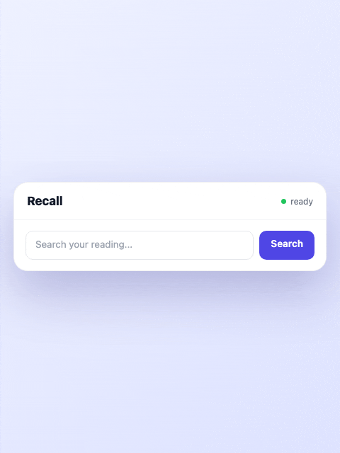

# Recall

**Re-find anything you've read on the web — by meaning, not by keyword — fully on your own device.**

<p align="center">
  
</p>

Recall is a local-first, privacy-first Chrome extension (Manifest V3) that quietly remembers the
pages you actually read and lets you search or ask about them later by *what they were about*. You
don't need to remember the title or the exact words. Ask "that article about mitochondria as the
cell's power plant" and Recall finds it using on-device English semantic search.

Your reading data stays on your machine. The BGE English embedding model, the WebLLM answer model,
and a SQLite database run in the browser. Model files may be loaded from the extension package or
from a configured Cloudflare R2 model bucket, but **the pages you read and the questions you ask do
not leave your computer**. No accounts, no telemetry, no ads.

---

## Why it exists

Browser history is a list of URLs. It's useless when you can't recall the site, only the *idea*.
Cloud "read-it-later" and AI memory tools solve the recall problem but make you ship your entire
reading history to someone else's server. Recall refuses that trade-off: it gives you semantic
recall **without** the privacy cost, by doing the embedding and the search locally.

---

## Privacy: the whole point

This is the differentiator, so it's worth stating plainly:

- **No reading-data egress.** Captured page text, page URLs, search queries, and Ask questions are
  processed locally. Model artifact downloads are separate: they contain public model files, not
  user data.
- **The models run locally.** The selected BGE English embedding model runs through Transformers
  ONNX in the browser. Ask answers use WebLLM, starting with Llama and keeping Gemma as the next
  candidate.
- **The database is local.** Captured text and vectors live in a `@sqlite.org/sqlite-wasm`
  database backed by `unlimitedStorage`, inside the extension's own origin.
- **No accounts, no telemetry, no ads.** Nothing to sign up for. Nothing phones home.
- **Sensitive pages are never captured.** A built-in denylist (`src/core/denylist.ts`) skips
  banking, webmail, auth/login, health portals, password managers, and app UIs you *operate*
  rather than read. You also get a per-site "don't remember this site" override and a global pause.

---

## Features

- **Automatic capture with an engagement gate.** Recall doesn't save every tab you flash past. A
  capture gate (`src/core/capture-gate.ts`) requires real engagement — enough readable text
  (extracted with Mozilla Readability), dwell time, and scrolling — before a page is remembered.
  Search-result pages (SERPs), internal browser pages, and thin pages are filtered out.
- **Semantic + hybrid search.** Queries run as on-device vector search *fused* with a SQLite FTS5
  full-text lane via Reciprocal Rank Fusion (`src/core/rrf.ts`), so an exact keyword match and a
  "close in meaning" match both surface. Lexical results can be up-weighted so an exact-term page
  beats an irrelevant high-cosine hit.
- **Document-level results.** Pages are chunked into paragraphs for embedding, but results are
  rolled up to the *document* so you see one entry per article, ranked by its best passage.
- **English-only quality target.** Recall optimizes for English retrieval quality.
- **Ask your saved pages.** Ask mode retrieves the best saved chunks, then WebLLM writes a short
  cited answer from those chunks.
- **Side panel UI.** A single Chrome side-panel surface for Search, History, and Settings — no
  popup. Toggle it with `Ctrl/Cmd+Shift+K`.
- **Onboarding.** An interactive first-run page that explains capture and lets you try a search
  on sample content immediately.
- **You're in control.** Pause capturing globally, forget a single page, block a whole site, or
  clear everything — all from Settings.

---

## Architecture

Recall follows a **hexagonal (ports & adapters)** design. The domain logic in `src/core` is pure
TypeScript with no Chrome or I/O dependencies — it talks to the outside world only through the
interfaces in `src/core/ports.ts`. That's why the core is covered by a large, fast unit-test suite
that never needs a browser.

The runtime is split across MV3's three contexts:

```
  ┌─────────────────────────────────────────────────────────────────┐
  │  Web page                                                        │
  │   content script (src/content) ── Readability extract +          │
  │     engagement/dwell tracking ──► capture gate ──► send to SW    │
  └───────────────────────────────┬─────────────────────────────────┘
                                  │ chrome.runtime messages
  ┌───────────────────────────────▼─────────────────────────────────┐
  │  Service worker (src/background)  — orchestration, no heavy work │
  └───────────────────────────────┬─────────────────────────────────┘
                                  │ offscreen RPC
  ┌───────────────────────────────▼─────────────────────────────────┐
  │  Offscreen document (src/offscreen)  — the engine                │
  │    • @huggingface/transformers embedder (WebGPU / WASM)          │
  │    • @mlc-ai/web-llm answer model (WebGPU)                       │
  │    • @sqlite.org/sqlite-wasm  (vectors + FTS5, in a Worker)      │
  └───────────────────────────────┬─────────────────────────────────┘
                                  │
  ┌───────────────────────────────▼─────────────────────────────────┐
  │  Side panel (src/ui)  — Preact: Search · History · Settings      │
  └─────────────────────────────────────────────────────────────────┘

  src/core  ── pure domain (chunking, gate, ranking, RRF, denylist…)
              depends on nobody; the rest depend on it via ports.ts
```

Why an offscreen document? MV3 service workers get reaped aggressively and can't reliably run
WebGPU or hold a WASM database. The offscreen document is the long-lived "engine room"; the service
worker is just the dispatcher (with a `chrome.alarms` re-drain so pending chunks get indexed even
after the worker sleeps).

---

## Tech stack

| Area | Choice |
|------|--------|
| Language | TypeScript (strict) |
| UI | Preact |
| Build | Vite + `@crxjs/vite-plugin` (MV3) |
| Database | `@sqlite.org/sqlite-wasm` (vectors + FTS5) |
| Embeddings | `@huggingface/transformers` (ONNX, WebGPU/WASM) |
| Embedding model | `Xenova/bge-base-en-v1.5` q8 |
| Ask model | WebLLM Llama first, Gemma candidate next |
| Readability | `@mozilla/readability` |
| Unit tests | Vitest |
| E2E | Playwright |

---

## Getting started

### Prerequisites

- Node.js 18+ (the build uses the built-in `fetch`; developed on Node 24)
- Google Chrome (or any Chromium with MV3 + side panel support)

### 1. Install dependencies

```bash
npm install
```

### 2. Get the embedding model

**The embedding model is not in the repo** because the ONNX file is large. The build's `prebuild`
step (`scripts/fetch-model.mjs`) checks for it and SHA-256-verifies whatever is on disk against
pinned hashes. If the model is missing, prepare it with:

```bash
npm run eval:fetch-model
```

Either way the four files (`onnx/model_quantized.onnx`, `tokenizer.json`, `config.json`,
`tokenizer_config.json`) must match the pinned SHA-256 hashes, which is the integrity guarantee.

> Note: `npm run build` also runs `fetch-model` automatically via `prebuild`. If you already have
> the model on disk, it just verifies and proceeds — no download.

To prepare model folders for Cloudflare R2, generate a manifest and upload the folder:

```bash
npm run models:manifest -- public/models/bge-base-en-v1.5 bge-base-en-v1.5 embedding v1 https://example.com/models/bge-base-en-v1.5/
npm run models:upload-r2 -- recall-models public/models/bge-base-en-v1.5 models/bge-base-en-v1.5 --dry-run
```

### 3. Build and load

```bash
npm run build
```

Then open `chrome://extensions`, enable **Developer mode**, click **Load unpacked**, and select the
generated `dist-ext/` folder. Open any article, read it for a bit, then hit `Ctrl/Cmd+Shift+K` and
search for it by meaning.

### 4. Test

```bash
npm test            # Vitest unit suite (pure-core domain logic)
npx playwright test # end-to-end flows in a real Chromium
```

---

## Engineering rigor

A few things I cared about while building this, for the curious:

- **A pure, well-tested core.** The hexagonal split keeps domain logic free of browser APIs, so
  the chunker, capture gate, ranking, RRF fusion, denylist, and URL sanitizers are covered by a
  large fast unit suite (~40 spec files), plus end-to-end Playwright flows for capture, search,
  history, persistence, and re-indexing.
- **A golden-set eval harness for search quality.** Search relevance is regression-tested against
  a hand-labeled corpus (`eval/`) — real fixtures, expected hits per query, and scorecards — so a
  ranking change is measured (recall@k, prose filtering, lexical weighting), not guessed. The
  many `eval/scorecard-*.json` files are the receipts of that tuning.
- **Pinned model artifacts.** Model folders are verified with SHA-256 manifests before they are
  used or uploaded, so a changed model file is caught early.

---

## Known limitation: English only

Recall is tuned for English. Other languages are out of scope for this version.

---

## License

[MIT](./LICENSE) © 2026 Minhyeok Kim — [github.com/markdownnn](https://github.com/markdownnn)

The embedding model is derived from
[`BAAI/bge-base-en-v1.5`](https://huggingface.co/BAAI/bge-base-en-v1.5).
